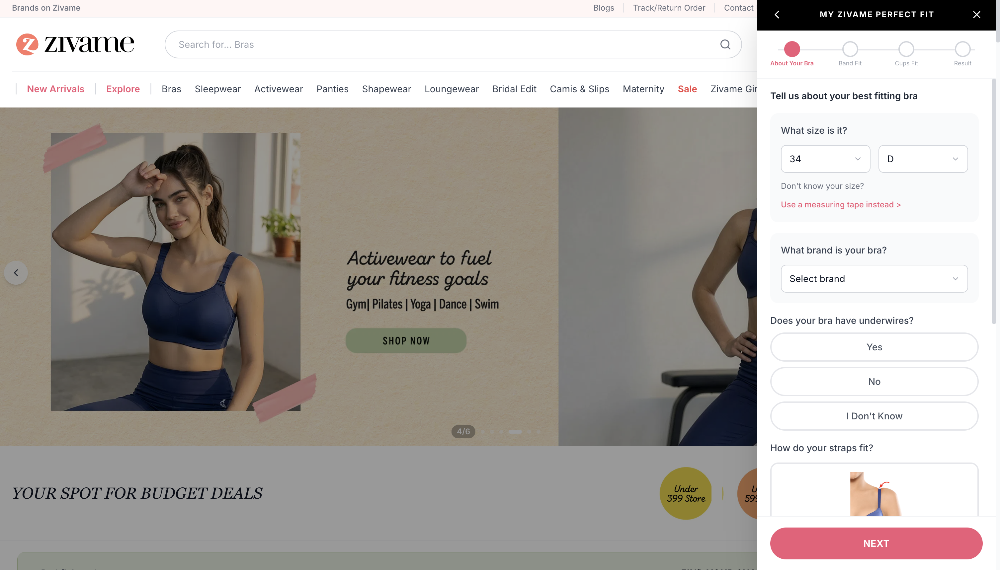
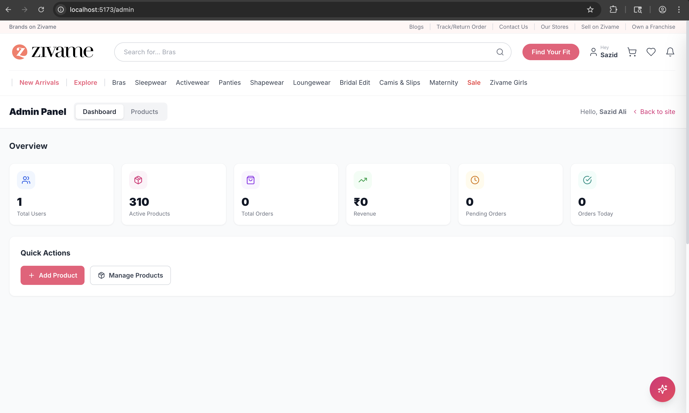

# Zivame-Clone — Full-Stack E-Commerce Platform

A production-grade, scalable e-commerce platform inspired by Zivame, built with **React + TypeScript** and **FastAPI + Python**.

---

## Screenshots





### 

## Tech Stack

### Frontend
- **React 18** + **TypeScript** + **Vite**
- **TailwindCSS** — utility-first styling
- **Zustand** — lightweight global state
- **React Query (TanStack)** — server state & caching
- **React Router v6** — client-side routing
- **Axios** — HTTP client with interceptors

### Backend
- **FastAPI** — async Python web framework
- **PostgreSQL** — primary relational database
- **Redis** — OTP storage, session cache, rate limiting
- **SQLAlchemy 2.0** — async ORM
- **Alembic** — database migrations
- **Celery + Redis** — background task queue (emails, SMS)
- **AWS S3** — product image storage
- **Twilio** — SMS OTP delivery
- **SendGrid** — Email OTP delivery
- **JWT (RS256)** — secure authentication tokens

### AI Features (Phase 2)
- **OpenAI / Anthropic** — AI Shopping Assistant
- **Sentence-Transformers** — product embeddings for recommendations
- **Pinecone / pgvector** — vector similarity search
- **MediaPipe / TensorFlow.js** — Virtual Try-On (client-side)

### Scraping
- **Playwright** — headless browser scraping
- **BeautifulSoup4** — HTML parsing
- **Scrapy** — crawling pipeline (optional)

---

## Project Structure

```
zivame-clone/
├── frontend/                    # React + TypeScript app
│   ├── src/
│   │   ├── components/
│   │   │   ├── auth/            # Login, Signup, OTP forms
│   │   │   ├── layout/          # Navbar, Footer, Sidebar
│   │   │   ├── product/         # ProductCard, ProductGrid, Filters
│   │   │   ├── ai/              # AIAssistant, VirtualTryOn, Recommendations
│   │   │   └── common/          # Button, Input, Modal, Toast
│   │   ├── pages/               # Route-level page components
│   │   ├── hooks/               # Custom React hooks
│   │   ├── services/            # API service layer (axios)
│   │   ├── store/               # Zustand stores
│   │   ├── utils/               # Helpers, formatters, validators
│   │   └── types/               # TypeScript interfaces & enums
│   ├── package.json
│   ├── tailwind.config.ts
│   └── vite.config.ts
│
├── backend/                     # FastAPI app
│   ├── app/
│   │   ├── api/v1/endpoints/    # Route handlers (auth, products, users, orders, ai)
│   │   ├── core/                # Config, security, dependencies
│   │   ├── models/              # SQLAlchemy ORM models
│   │   ├── schemas/             # Pydantic request/response schemas
│   │   ├── services/            # Business logic layer
│   │   └── utils/               # OTP, SMS, email helpers
│   ├── alembic/                 # Database migrations
│   ├── scraper/                 # Playwright-based product scraper
│   ├── requirements.txt
│   └── Dockerfile
│
├── screenshots
│
├── docker-compose.yml
├── .env.example
└── README.md
```

---

## Quick Start

### Prerequisites
- Node.js 18+, Python 3.11+, Docker & Docker Compose

### 1. Clone & Configure
```bash
git clone <repo-url> && cd zivame-clone
cp .env.example .env
# Fill in your secrets in .env
```

### 2. Start with Docker Compose
```bash
docker-compose up --build
```

- Frontend: http://localhost:5173
- Backend API: http://localhost:8000
- API Docs: http://localhost:8000/docs

### 3. Run Migrations
```bash
docker-compose exec backend alembic upgrade head
```

### 4. Scrape Products (optional)
```bash
docker-compose exec backend python -m scraper.run --pages 5
```

---

## Authentication Flow

```
User enters mobile/email
  → POST /api/v1/auth/send-otp     # Generates & sends OTP via Twilio/SendGrid
  → OTP stored in Redis (5 min TTL)
  → User enters OTP
  → POST /api/v1/auth/verify-otp   # Validates OTP, issues JWT
  → JWT stored in httpOnly cookie + localStorage (access + refresh tokens)
```

---

## AI Features Roadmap

| Feature | Status | Tech |
|---|---|---|
| OTP Auth (mobile + email) | ✅ Ready | Twilio, SendGrid, Redis |
| Product Catalog + Filters | ✅ Ready | PostgreSQL, FastAPI |
| AI Shopping Assistant | 🔧 Phase 2 | OpenAI / Claude API |
| Recommendation Engine | 🔧 Phase 2 | pgvector + embeddings |
| Virtual Try-On | 🔧 Phase 2 | MediaPipe + TF.js |

---

## Environment Variables

See `.env.example` for all required variables including database, Redis, Twilio, SendGrid, JWT secrets, and AI API keys.

---

## Zero-Spend Setup (Default)

The project runs **completely free** out of the box. No paid API keys needed.

| Feature | Free Mode | Paid Upgrade |
|---|---|---|
| SMS OTP | OTP printed to server logs (`docker compose logs -f backend`) | Set `TWILIO_ACCOUNT_SID` + `TWILIO_AUTH_TOKEN` + `TWILIO_PHONE_NUMBER` |
| Email OTP | Console log → or use free Gmail SMTP (set `SMTP_HOST` etc.) | Set `SENDGRID_API_KEY` |
| Image Storage | Local disk inside Docker volume | Set `AWS_ACCESS_KEY_ID` + `AWS_SECRET_ACCESS_KEY` |
| AI Assistant | Keyword-based responses (size, returns, delivery, payment, care) | Set `ANTHROPIC_API_KEY` (Claude) or `OPENAI_API_KEY` |
| Product Recommendations | Same-category top-rated fallback | Auto-upgrades to pgvector semantic search once embeddings are generated |
| Database | Self-hosted PostgreSQL in Docker | Any managed Postgres (Supabase, Neon, RDS) |
| Cache/Queue | Self-hosted Redis in Docker | Redis Cloud free tier (30MB) |

### Reading OTPs in Dev Mode

When no SMS/email provider is configured, OTPs appear in the backend logs:

```
docker compose logs -f backend
```

You'll see:
```
====================================================
  [OTP — SMS]  LOGIN
  To      : +919876543210
  OTP     : 482910
  Expires : 5 minutes
====================================================
```

The frontend also shows a dev-mode hint in the OTP input screen when running on `localhost`.

### Free Email via Gmail SMTP

To send real OTP emails for free using Gmail:

1. Enable 2-factor auth on your Google account
2. Go to Google Account → Security → App Passwords → generate one
3. Add to `.env`:

```env
SMTP_HOST=smtp.gmail.com
SMTP_PORT=587
SMTP_USER=your-gmail@gmail.com
SMTP_PASSWORD=your-16-char-app-password
SMTP_USE_TLS=true
```

### Enabling Paid Services Later

Every paid service is **opt-in by adding a key to `.env`**. No code changes needed:

```env
# Uncomment and fill in to activate each service:
# TWILIO_ACCOUNT_SID=ACxxx
# SENDGRID_API_KEY=SG.xxx
# AWS_ACCESS_KEY_ID=xxx
# ANTHROPIC_API_KEY=sk-ant-xxx
```

The `GET /health` endpoint shows which mode each service is running in:

```json
{
  "status": "ok",
  "services": {
    "images": "local",
    "ai": "rule-based",
    "sms": "console",
    "email": "console"
  }
}
```
